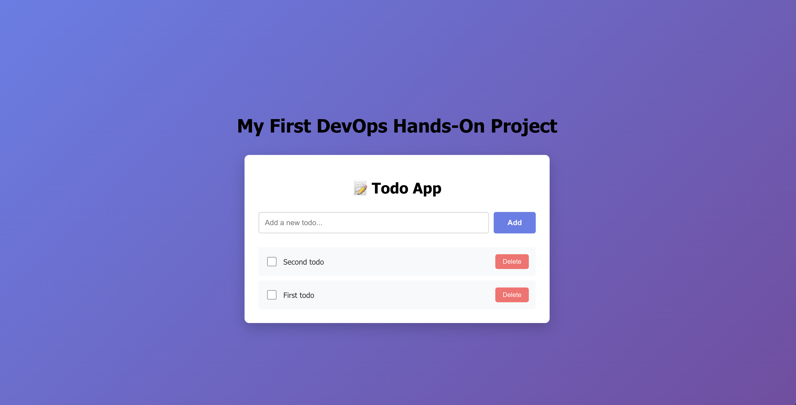

# MERN Todo App - DevOps CI/CD Project

> A full-stack todo application demonstrating modern DevOps practices with automated deployment pipeline



**Live Demo:** [https://buildnship.site](https://buildnship.site)

---

## 📋 Table of Contents

- [Overview](#overview)
- [Architecture](#architecture)
- [Tech Stack](#tech-stack)
- [Features](#features)
- [Project Structure](#project-structure)
- [Getting Started](#getting-started)
- [DevOps Pipeline](#devops-pipeline)
- [Deployment](#deployment)
- [What I Learned](#what-i-learned)

---

## 🎯 Overview

This project is a production-ready MERN (MongoDB, Express, React, Node.js) todo application deployed on AWS with a fully automated CI/CD pipeline. The main focus is on implementing DevOps best practices including containerization, automated deployments, reverse proxy configuration, and SSL/HTTPS security.

### Key Achievements

✅ **Containerized Architecture** - Multi-container Docker setup with Docker Compose  
✅ **Automated CI/CD** - GitHub Actions pipeline with zero-downtime deployments  
✅ **Container Registry** - GitHub Container Registry (GHCR) for image management  
✅ **Cloud Infrastructure** - AWS EC2 with custom domain configuration  
✅ **Reverse Proxy** - Nginx for routing and load balancing  
✅ **SSL/HTTPS** - Let's Encrypt certificate with auto-renewal  
✅ **DNS Management** - Route 53 hosted zone with proper A records  

---

## 🏗️ Architecture

```
┌─────────────────────────────────────────────────────────────────────┐
│                            DEVELOPER                                │
│                                                                     │
│  Local Development → Git Push → GitHub Repository                  │
└────────────────────────────┬────────────────────────────────────────┘
                             │
                             ▼
┌─────────────────────────────────────────────────────────────────────┐
│                       GITHUB ACTIONS CI/CD                          │
│                                                                     │
│  1. Checkout Code                                                   │
│  2. Build Docker Images (Backend + Frontend)                        │
│  3. Push Images to GHCR                                             │
│  4. SSH to EC2                                                      │
│  5. Pull Images & Deploy                                            │
└────────────────────────────┬────────────────────────────────────────┘
                             │
                             ▼
┌─────────────────────────────────────────────────────────────────────┐
│                    GITHUB CONTAINER REGISTRY                        │
│                                                                     │
│  📦 ghcr.io/syed-moazzam/mern-todo-app-devops/backend:sha-xxxxx    │
│  📦 ghcr.io/syed-moazzam/mern-todo-app-devops/frontend:sha-xxxxx   │
└────────────────────────────┬────────────────────────────────────────┘
                             │
                             ▼
┌─────────────────────────────────────────────────────────────────────┐
│                           AWS CLOUD                                 │
│  ┌───────────────────────────────────────────────────────────────┐ │
│  │                    Route 53 (DNS)                             │ │
│  │  buildnship.site → 13.232.201.245                             │ │
│  └──────────────────────────┬────────────────────────────────────┘ │
│                             │                                       │
│                             ▼                                       │
│  ┌───────────────────────────────────────────────────────────────┐ │
│  │              EC2 Instance (Ubuntu 24.04)                      │ │
│  │  Region: ap-south-1 (Mumbai)                                  │ │
│  │  Type: t2.micro                                               │ │
│  │                                                               │ │
│  │  ┌─────────────────────────────────────────────────────────┐ │ │
│  │  │              NGINX (Reverse Proxy)                      │ │ │
│  │  │  Port 80/443 → Routes traffic                           │ │ │
│  │  │  SSL/TLS: Let's Encrypt                                 │ │ │
│  │  └────────┬──────────────────────────┬───────────────────┘ │ │
│  │           │                          │                       │ │
│  │           ▼                          ▼                       │ │
│  │  ┌─────────────────┐       ┌──────────────────┐            │ │
│  │  │   Frontend      │       │    Backend       │            │ │
│  │  │   Container     │       │    Container     │            │ │
│  │  │   React App     │       │    Express API   │            │ │
│  │  │   Port: 3000    │◄──────┤    Port: 5000    │            │ │
│  │  └─────────────────┘       └────────┬─────────┘            │ │
│  │                                      │                       │ │
│  │                                      ▼                       │ │
│  │                            ┌──────────────────┐             │ │
│  │                            │    MongoDB       │             │ │
│  │                            │    Container     │             │ │
│  │                            │    Port: 27017   │             │ │
│  │                            └──────────────────┘             │ │
│  │                                                               │ │
│  │  Docker Network: todo-network (bridge)                       │ │
│  └───────────────────────────────────────────────────────────────┘ │
└─────────────────────────────────────────────────────────────────────┘
                             │
                             ▼
┌─────────────────────────────────────────────────────────────────────┐
│                            END USERS                                │
│                                                                     │
│  https://buildnship.site → Secure Access via HTTPS                 │
└─────────────────────────────────────────────────────────────────────┘
```

### Data Flow

1. **User Request** → HTTPS request to `buildnship.site`
2. **DNS Resolution** → Route 53 resolves to EC2 IP
3. **SSL Termination** → Nginx handles SSL/TLS
4. **Reverse Proxy** → Nginx routes to appropriate container
   - `/` → Frontend container (port 3000)
   - `/api/*` → Backend container (port 5000)
5. **Backend Processing** → Express API queries MongoDB
6. **Response** → Secure response back to user

---

## 🛠️ Tech Stack

### Frontend
- **React** - UI library
- **Axios** - HTTP client
- **CSS3** - Styling

### Backend
- **Node.js** - Runtime environment
- **Express.js** - Web framework
- **Mongoose** - MongoDB ODM
- **CORS** - Cross-origin resource sharing

### Database
- **MongoDB** - NoSQL database

### DevOps & Infrastructure
- **Docker** - Containerization
- **Docker Compose** - Multi-container orchestration
- **GitHub Actions** - CI/CD pipeline
- **GitHub Container Registry (GHCR)** - Container image storage
- **AWS EC2** - Virtual server hosting
- **AWS Route 53** - DNS management
- **Nginx** - Reverse proxy & web server
- **Let's Encrypt** - SSL/TLS certificates
- **Certbot** - Certificate management

---

## ✨ Features

### Application Features
- ✅ Create new todos
- ✅ Mark todos as complete/incomplete
- ✅ Delete todos
- ✅ Persistent storage with MongoDB
- ✅ Real-time updates
- ✅ Responsive design

### DevOps Features
- ✅ Automated build and deployment
- ✅ Zero-downtime deployments
- ✅ Container-based architecture
- ✅ Multi-platform builds (AMD64 & ARM64)
- ✅ Environment-specific configurations
- ✅ Automated SSL certificate renewal
- ✅ Image versioning with Git SHA tags
- ✅ Automatic cleanup of old images

---

## 📁 Project Structure

```
mern-todo-app-devops/
├── .github/
│   └── workflows/
│       └── deploy.yml          # CI/CD pipeline configuration
├── backend/
│   ├── models/
│   │   └── Todo.js            # Todo schema
│   ├── routes/
│   │   └── todos.js           # API routes
│   ├── server.js              # Express server
│   ├── package.json
│   ├── Dockerfile             # Backend container image
│   └── .dockerignore
├── frontend/
│   ├── src/
│   │   ├── App.js             # Main React component
│   │   └── App.css            # Styles
│   ├── public/
│   ├── package.json
│   ├── Dockerfile             # Frontend container image
│   └── .dockerignore
├── docker-compose.yml         # Multi-container configuration
├── .gitignore
└── README.md
```

---

## 🚀 Getting Started

### Prerequisites

- Node.js (v18+)
- Docker & Docker Compose
- Git

### Local Development

1. **Clone the repository**
   ```bash
   git clone https://github.com/Syed-Moazzam/mern-todo-app-devops.git
   cd mern-todo-app-devops
   ```

2. **Start with Docker Compose**
   ```bash
   # Build and start all services
   docker compose up --build

   # Or run in detached mode
   docker compose up -d
   ```

3. **Access the application**
   - Frontend: http://localhost:3000
   - Backend API: http://localhost:5000/api/todos
   - Health Check: http://localhost:5000/health

4. **Stop the application**
   ```bash
   docker compose down
   ```

### Manual Setup (Without Docker)

**Backend:**
```bash
cd backend
npm install
npm start
```

**Frontend:**
```bash
cd frontend
npm install
npm start
```

**MongoDB:**
- Install MongoDB locally or use MongoDB Atlas
- Update `MONGODB_URI` in backend/.env

---

## 🔄 DevOps Pipeline

### CI/CD Workflow

The deployment pipeline is triggered automatically on every push to the `main` branch:

```yaml
Push to main → Build Images → Push to GHCR → Deploy to EC2
```

### Pipeline Steps

1. **Build Job**
   - Checkout code from repository
   - Login to GitHub Container Registry
   - Build multi-platform Docker images (AMD64, ARM64)
   - Tag images with Git commit SHA
   - Push images to GHCR

2. **Deploy Job**
   - SSH into EC2 instance
   - Generate `.env` with current image tag
   - Pull latest code from GitHub
   - Pull new Docker images from GHCR
   - Stop old containers
   - Start new containers
   - Clean up old images

### GitHub Secrets Required

Configure these secrets in your GitHub repository settings:

- `EC2_HOST` - EC2 instance public IP
- `EC2_SSH_KEY` - Private SSH key for EC2 access
- `GHCR_PAT` - GitHub Personal Access Token (for pulling images)

---

## 🌐 Deployment

### AWS Infrastructure Setup

1. **EC2 Instance**
   - Launch Ubuntu 24.04 LTS instance
   - Instance type: t2.micro (free tier)
   - Region: ap-south-1 (Mumbai)
   - Security groups: Allow ports 22, 80, 443

2. **Domain Configuration**
   - Purchase domain (e.g., buildnship.site)
   - Create Route 53 hosted zone
   - Update nameservers at domain registrar
   - Create A record pointing to EC2 IP

3. **Server Setup**
   ```bash
   # Install Docker
   sudo apt update
   sudo apt install docker.io docker-compose-plugin
   
   # Install Nginx
   sudo apt install nginx
   
   # Install Certbot
   sudo apt install certbot python3-certbot-nginx
   ```

4. **SSL Certificate**
   ```bash
   sudo certbot --nginx -d buildnship.site -d www.buildnship.site
   ```

### Nginx Configuration

Located at `/etc/nginx/sites-available/buildnship.site`:

```nginx
server {
    listen 80;
    server_name buildnship.site www.buildnship.site;
    
    location / {
        proxy_pass http://localhost:3000;
        proxy_http_version 1.1;
        proxy_set_header Upgrade $http_upgrade;
        proxy_set_header Connection 'upgrade';
        proxy_set_header Host $host;
        proxy_cache_bypass $http_upgrade;
    }
    
    location /api {
        proxy_pass http://localhost:5000/api;
        # ... proxy headers
    }
}
```

---

## 📚 What I Learned

### Docker & Containerization
- Creating optimized Dockerfiles
- Multi-stage builds for smaller images
- Docker Compose for orchestration
- Container networking
- Volume management for data persistence

### CI/CD Pipeline
- GitHub Actions workflow syntax
- Building multi-platform images
- Container registry management
- SSH-based deployments
- Environment variable handling

### AWS Cloud Services
- EC2 instance management
- Security group configuration
- Route 53 DNS management
- Understanding cloud networking

### Nginx & Web Servers
- Reverse proxy configuration
- SSL/TLS certificate setup
- Request routing
- Let's Encrypt certificate automation

### DevOps Best Practices
- Infrastructure as Code principles
- Automated testing and deployment
- Version control with Git
- Environment-specific configurations
- Zero-downtime deployment strategies

---

## 🔧 Troubleshooting

### Common Issues

**Containers not starting:**
```bash
docker compose logs
docker ps -a
```

**Port already in use:**
```bash
# Find process using port
sudo lsof -i :3000
# Kill the process
kill -9 <PID>
```

**Image pull errors:**
- Verify GHCR packages are public
- Check image names match docker-compose.yml
- Ensure proper GitHub token permissions

**502 Bad Gateway:**
- Check if containers are running: `docker ps`
- Verify Nginx configuration: `sudo nginx -t`
- Check application logs: `docker compose logs`

---

## 📈 Future Enhancements

- [ ] Add automated testing (Jest, React Testing Library)
- [ ] Implement monitoring (Prometheus + Grafana)
- [ ] Set up centralized logging (ELK stack)
- [ ] Add staging environment
- [ ] Implement database backups
- [ ] Migrate to Kubernetes for orchestration
- [ ] Add load balancer for multiple instances
- [ ] Implement blue-green deployments

---

## 🤝 Contributing

This is a learning project, but suggestions and improvements are welcome!

1. Fork the repository
2. Create a feature branch (`git checkout -b feature/improvement`)
3. Commit your changes (`git commit -am 'Add new feature'`)
4. Push to the branch (`git push origin feature/improvement`)
5. Create a Pull Request

---

## 📝 License

This project is open source and available under the [MIT License](LICENSE).

---

## 👤 Author

**Syed Moazzam Ahmed**

- GitHub: [@Syed-Moazzam](https://github.com/Syed-Moazzam)
- Project Link: [https://github.com/Syed-Moazzam/mern-todo-app-devops](https://github.com/Syed-Moazzam/mern-todo-app-devops)
- Live Demo: [https://buildnship.site](https://buildnship.site)

---

## 🙏 Acknowledgments

- Docker documentation
- AWS documentation
- GitHub Actions documentation
- Nginx documentation
- The DevOps community

---

**⭐ If you found this project helpful, please consider giving it a star!**
